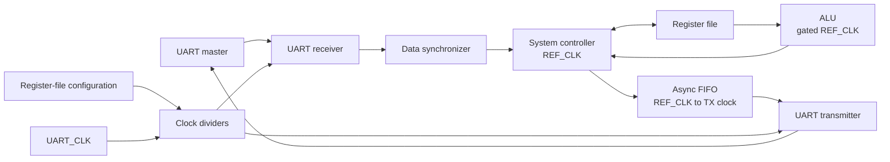

# Low-Power Configurable Multi-Clock Digital System

**UART-controlled digital system integrating a register file, ALU, clock
management, CDC synchronizers, and an asynchronous FIFO.**

[System design document](docs/Final_System.pdf) ·
[Architecture](docs/architecture.md) ·
[UART command protocol](docs/uart-protocol.md) ·
[Verification results](docs/verification-results.md)

## Overview

The system accepts command bytes over UART, processes register-file or ALU
operations, and returns response bytes over UART. The control and computation
logic use a 50 MHz reference clock; the serial interface uses a 3.6864 MHz
UART reference clock with programmable clock division. Dedicated synchronizers
and an asynchronous FIFO bridge the clock domains.

The RTL is parameterized for data width, register-file depth, FIFO depth, and
ALU result width. The default configuration uses 8-bit data, a 16-entry
register file, an 8-entry asynchronous FIFO, and a 16-bit ALU result.

## Architecture



| Block | Role |
| --- | --- |
| System controller | Decodes UART commands and sequences register, ALU, and response operations |
| Register file | Stores ALU operands, UART/clock configuration, and general-purpose data |
| ALU | Executes arithmetic, logic, comparison, and shift operations |
| UART RX/TX | Receives command frames and serializes response data |
| Clock dividers and gate | Generate UART clocks and reduce unnecessary ALU clock activity |
| Reset/data synchronizers | Synchronize resets and received data across clock domains |
| Asynchronous FIFO | Buffers response bytes between the reference and transmit clock domains |

See [the architecture note](docs/architecture.md) for the clocking, reset,
register, and data-flow details.

## System specifications

| Parameter | Default |
| --- | ---: |
| Reference clock | 50 MHz |
| UART reference clock | 3.6864 MHz |
| UART data width | 8 bits |
| Register file | 16 × 8 bits |
| ALU result | 16 bits |
| Asynchronous FIFO | 8 × 8 bits |
| UART parity | Enabled; even parity |
| UART prescale | 32 |
| TX clock division ratio | 32 |

At the default clock and division settings, the UART bit rate is 115,200 baud.
The reset values are `REG2 = 0x81` (parity enabled, even parity, prescale 32)
and `REG3 = 0x20` (TX division ratio 32).

## UART command summary

Each command consists of 8-bit UART data frames. The receiver supports the
configured optional parity bit. Command bytes and payloads are sent in this
order:

| Command | Byte sequence | Action |
| --- | --- | --- |
| `0xAA` | command, address, data | Write configuration/general-purpose register |
| `0xBB` | command, address | Read register and return its data |
| `0xCC` | command, operand A, operand B, ALU function | Run ALU with command-supplied operands |
| `0xDD` | command, ALU function | Run ALU using operands already stored in `REG0` and `REG1` |

ALU responses are 16 bits and are returned as two 8-bit bytes, least-significant
byte first. The full operation encoding and register map are in
[the UART protocol reference](docs/uart-protocol.md).

## Repository layout

```text
.
├── Cell_Library/              # Standard-cell timing libraries
├── Spyglass/                  # SpyGlass project, constraints, and waivers
├── Synthesis_Formality_DFT/   # Synthesis, formal, and DFT flow artifacts
├── System_pnr/                # Place-and-route inputs and implementation data
├── Testbench/                 # System-level SystemVerilog testbench
├── docs/                      # Design reference PDF and project notes
├── reports/                   # Curated verification and implementation reports
├── rtl/                       # Synthesizable RTL and source lists
├── run.do                     # ModelSim/Questa simulation entry point
└── wave.do                    # Waveform setup
```

## Simulation

The project testbench is `Testbench/tb.sv`; its RTL compile order is maintained
in `rtl/rtl.f`. With ModelSim/Questa installed, start the simulator from the
repository root and run:

```tcl
do run.do
```

`run.do` compiles the listed RTL and testbench, starts `work.tb`, loads
`wave.do`, and runs until the testbench's `$stop`. The current testbench applies
configuration writes and ALU commands; it is a stimulus bench and does not
automatically compare returned UART results against expected values.

## Verification and implementation

Curated reports are under [`reports/`](reports/README.md). The checked-in
results include:

| Flow | Recorded result |
| --- | --- |
| Formality | Verification succeeded: 343 passing compare points, no failing compare points |
| SpyGlass CDC verification | 0 failed properties; 4 partial proofs out of 6 properties |
| SpyGlass RTL lint | Run summary records 1 waived error and 4 waived warnings; no non-waived errors or warnings |
| Post-DFT test design rule check | 1 constant-one latch violation is reported |
| PNR geometry and antenna checks | Reports state no geometry DRC violations and no antenna violations |

These are the results present in the archived reports, not a claim that all
signoff checks are clean. See [verification details](docs/verification-results.md)
for important caveats and report locations.

## Design document

The supplied [Final System design PDF](docs/Final_System.pdf) is retained as
the original system-level reference. Where it conflicts with the RTL, the
implemented RTL behavior is identified in the repository notes.
